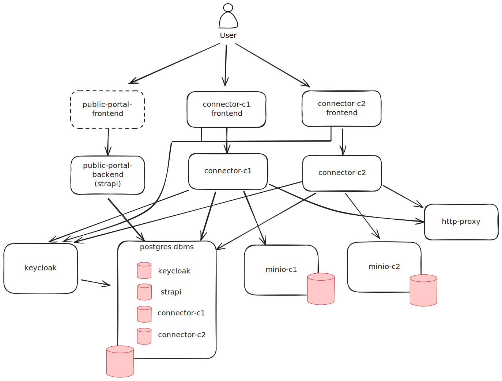

# INESData Local Environment

El entorno `INESData Local Environment` permite a los usuarios familiarizarse con el conector INESData. Mediante la
ejecución del entorno local, los usuarios podrán conocer cómo funciona el conector de InesData así como comprobar cómo
interactúan varios conectores entre sí.

## Componentes del entorno

A continuación se muestra un diagrama con los componentes que se ejecutan en el entorno local:



## Pre requisitos

Un entorno Linux con Docker y Docker compose instalados.

## Ejecución del entorno de pruebas

Para ejecutar localmente el entorno se debe ejecutar el script `generate-env.sh`  o `generate-env.ps1` (Powershell) que generará un archivo .env con
valores autogenerados para los secretos y tokens. 

```
generate-env.sh
```
o
```
generate-env.ps1
```

Una vez hecho esto, se puede llamar a `docker compose up` para levantar el entorno.

```
docker compose up
```

Se proporciona la colección [INESData Local
Environment](resources/operations/InesData_Local_Environment.postman_collection.json) en formato Postman para realizar
ejemplos del ciclo de vida de creación y compartición de datos entre los conectores del entorno. Además, se dispone de la colección [INESData Connector Management](resources/operations/InesData_Connector_Management_API.postman_collection.json) en formato Postman para mostrar las principales operaciones del API de INESData para gestionar las diferentes entidades disponibles.

**Nota:** Las transferencias de tipo `HttpProxy` enviarán la información para la descarga de Assets a través del
servicio `http-proxy`. Este componente devuelve por consola las peticiones HTTP recibidas, incluídas las proporcionadas
por los conectores con la información de descarga de los Assets. Si se quienres ver sus logs se debe ejecutar el comando 

```
docker compose logs -f http-proxy
```

## Interfaz de gestión de los conectores

Los conectores vienen con una interfaz de gestión en las siguientes direcciones:
- connector-c1: http://localhost:8001/inesdata-connector-interface
- connector-c2: http://localhost:8002/inesdata-connector-interface

## Administración

### Minio

Las URLs de administración de MinIO son respectivamente:
- connector-c1: http://localhost:9001/browser
- connector-c2: http://localhost:9011/browser

### PostgreSQL

Las conexiones a PostgreSQL se realizan mediante la cadena de conexión:
```
localhost:5432/<nombre_bd>
```

donde <nombre_bd> es el nombre de la BD de cada componente que requiere una (keycloak, strapi y ambos conectores).
Revisar el fichero [docker-compose.yml](docker-compose.yml) para más información sobre estos parámetros.

### Backend CMS (Strapi)

La URL de administración de Strapi es la siguiente:
- http://localhost:1337/admin

### Portal público

La URL del portal público es la siquiente:
- http://localhost/

Para visualizar correctamente esta página es necesario hacer lo siguiente:
- Crear una instancia del tipo de contenido Landing Page en public-portal-backend: Content Manager > Landing Page. Guardar y publicar el contenido.
- Dar permiso de visualización en la API sobre el contenido que previamente se ah creado: Settings > Users & Permissions Plugin > Roles > Public > Permissions > Landding-page. Habilitar el checkbox "find".
- Dar permiso para obtener el catálogo federado: Settings > Users & Permissions Plugin > Roles > Public > Permissions > Get-federated-catalog. Habilitar el checkbox "getFederatedCatalog".

## Hostnames

Los componentes que conforman el entorno local se comunican entre ellos a través de los nombres de host internos de Docker. Aunque casi todos son accesibles correctamente mediante `localhost`, hay una excepción que es `Keycloak`. Para poder acceder correctamente a la autorización de los portales de gestión de los conectores (inesdata-connector-interface) así como para acceder a la web de administración, Keycloak intentará acceder al host configurado en la propiedad `KC_HOSTNAME`. Se debe añarir la siguiente regla al archivo `hosts` del sistema operativo:

```
## INESDATA
127.0.0.1          keycloak
```

## Usuarios de Keycloak

Los usuarios incluidos en el entorno local son (misma contraseña y nombre de usuario):
- user-c1
  - Username: user-c1
  - Email: user-c1@dataspace.com
  - First name: user-c1
  - Last name: user-c1
  - region: eu
  - Groups: connector-c1
- user-c2
  - Username: user-c2
  - Email: user-c2@dataspace.com
  - First name: user-c2
  - Last name: user-c2
  - region: eu
  - Groups: connector-c2
