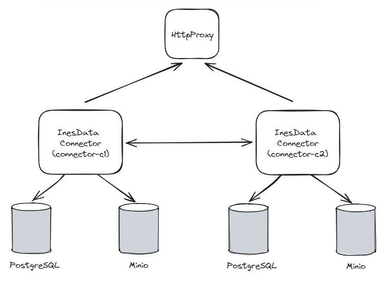

# InesData Local Environment

El entorno `InesData Local Environment` permite a los usuarios familiarizarse con el conector InesData. Mediante la ejecución del entorno local, los usuarios podrán conocer cómo funciona el conector de InesData así como comprobar cómo interactúan varios conectores entre sí.

## Componentes del entorno

A continuación se muestra un diagrama con los componentes que se ejecutan en el entorno local:



## Pre requisitos

Para poder ejecutar el entorno local de InesData se debe tener una imagen local del conector tageada como `inesdata/connector:0.2.0`. Para ello se deben seguir los siguientes pasos:

- Descargar el proyecto InesData Connector
- Seguir los pasos indicados en la documentación del repositorio para contenerizar el conector asegurándose que se genere el tage indicado con el modificador `--tag inesdata/connector:0.2.0`

## Ejecución del conector

Para ejecutar localmente el entorno se debe ejecutar el comando:

```
docker compose up
```

Se proporciona la colección [InesData Local Environment](resources/operations/InesData_Local_Environment.postman_collection.json) en formato Postman para realizar ejemplos de interacciones entre los conectores del entorno. 

**Nota:** Las transferencias de tipo `HttpProxy` enviarán la información para la descarga de Assets a través del servicio `http-proxy`. Este componente devuelve por consola las peticiones HTTP recibidas, incluídas las proporcionadas por los conectores con la información de descarga de los Assets. Si se quienres ver sus logs se debe ejecutar el comando 

```
docker compose logs -f http-proxy
```

## Administración

Las URLs de administración de MinIO son respectivamente:
- connector-c1: http://localhost:9001/browser
- connector-c2: http://localhost:9011/browser

Las conexiones a PostgreSQL se realizan mediante los datos:
- connector-c1: localhost:5432/inesdata
- connector-c2: localhost:5433/inesdata

Los usuarios se encuentran en el fichero [docker-compose.yml](docker-compose.yml)

## Usuarios de Keycloak

La versión 24 de Keycloak no exporta los usuarios de la aplicación por motivos de seguridad. Por este motivo, dentro del realm 'dataspace' se deben crear los siguientes usuarios (Users > Create new user):
- user-c1
  - Creación:
    - Required user action: Ninguno (Select action)
    - Email verified: Yes
    - Username: user-c1
    - Email: user-c1@dataspace.com
    - First name: user-c1
    - Last name: user-c1
    - region: eu
    - Groups: connector-c1
  - Credentials (Set password):
    - Password: user-c1
    - Password confirmation: user-c1
    - Temporary: Off
- user-c2
  - Creación:
    - Required user action: Ninguno (Select action)
    - Email verified: Yes
    - Username: user-c2
    - Email: user-c2@dataspace.com
    - First name: user-c2
    - Last name: user-c2
    - region: eu
    - Groups: connector-c2
  - Credentials (Set password):
    - Password: user-c2
    - Password confirmation: user-c2
    - Temporary: Off
